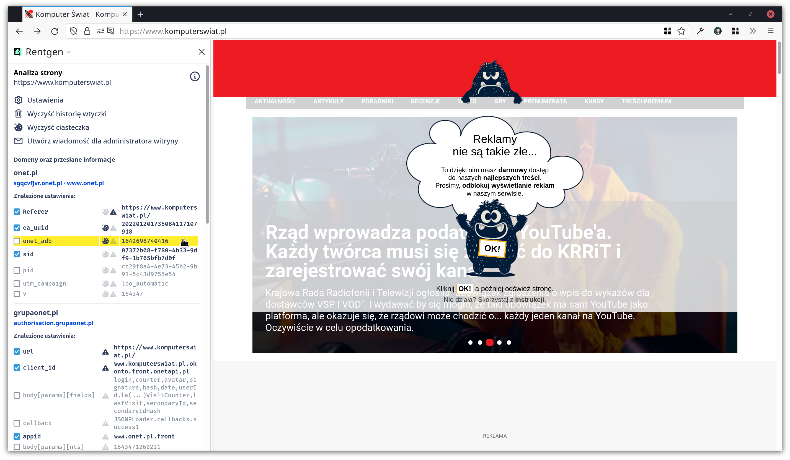
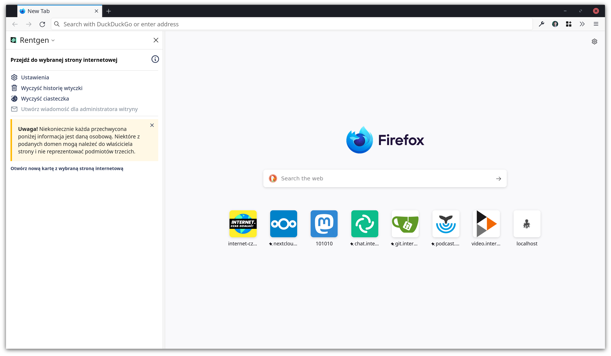
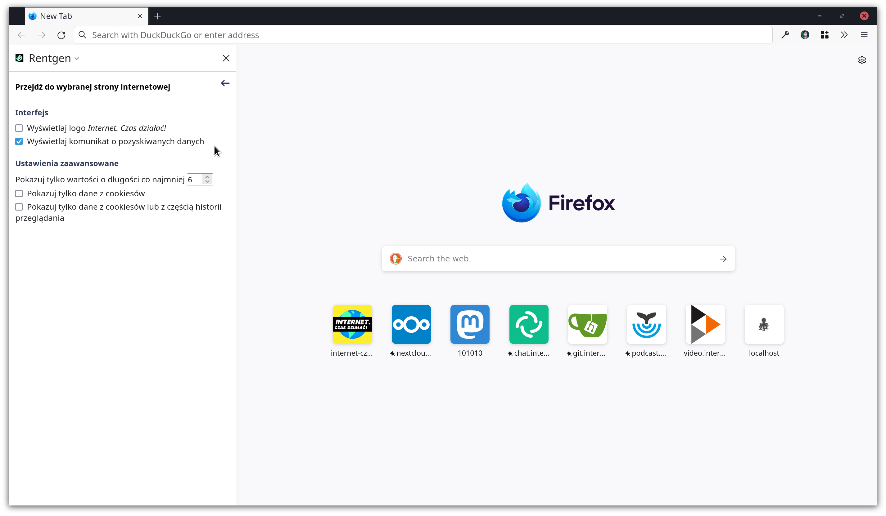

<h1 style="display: flex; align-items: center;"> Rentgen</h1>

## Description

<strong>Rentgen</strong> to wtyczka dla przeglądarek opartych o Firefoxa, która automatycznie wizualizuje, jakie dane zostały ~~wykradzione~~ wysłane do podmiotów trzecich przez odwiedzane strony.

<strong>Rentgen</strong> is an add-on prepared for Firefox based browsers. This extension will automatically visualize all the data that a given website sends to third parties.

Note: At the moment, we support Polish language because this extension generates mail content that is dedicated to Polish website owners. In further versions of this add-on, we will add other languages as well.

## How build and run add-on

1. `npm install`
2. `npm run build`
3. The build code is located in the `lib/` directory

