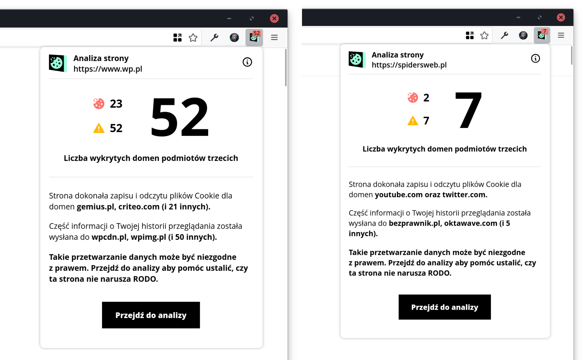
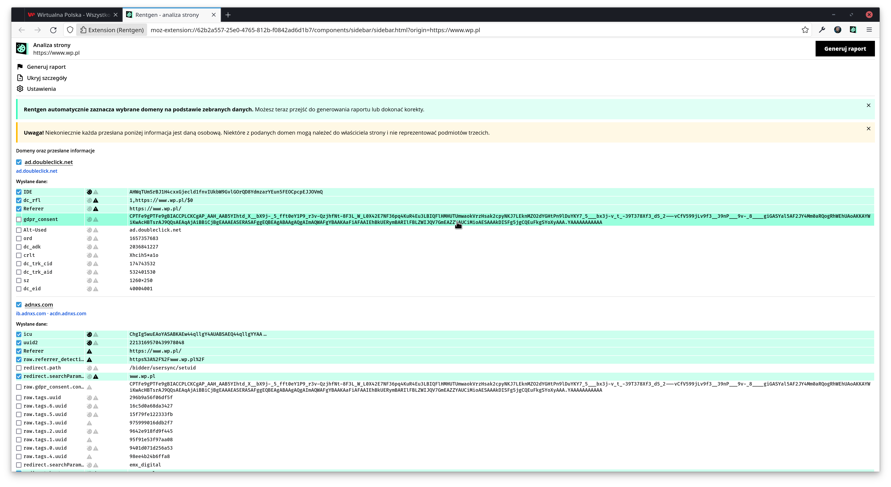
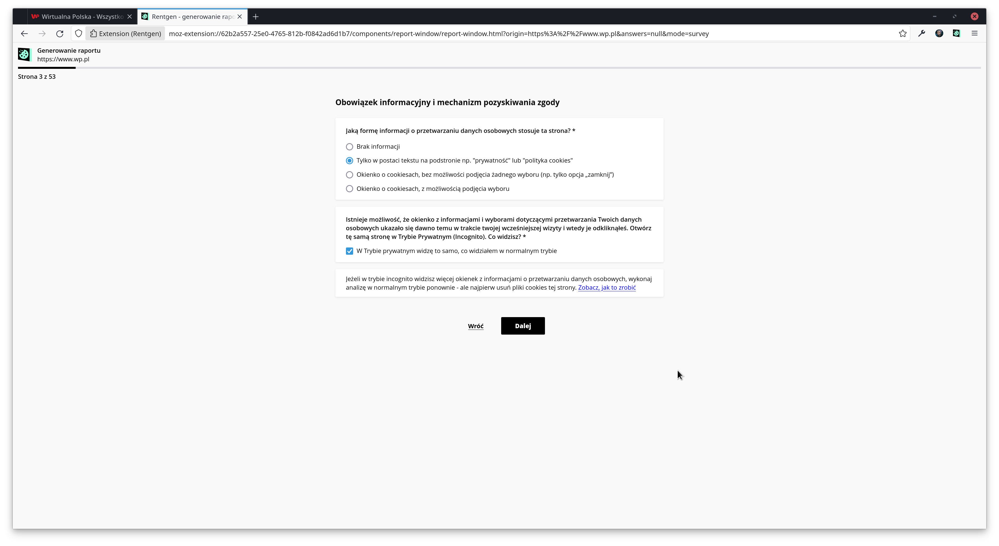
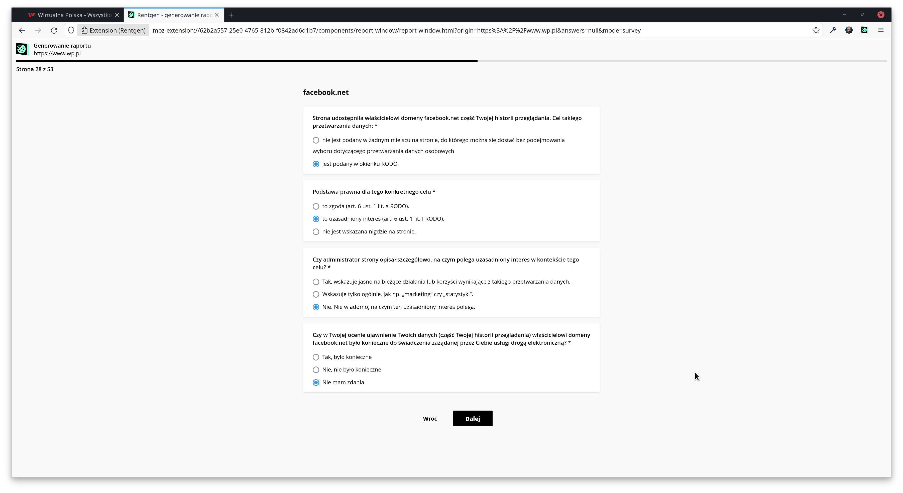
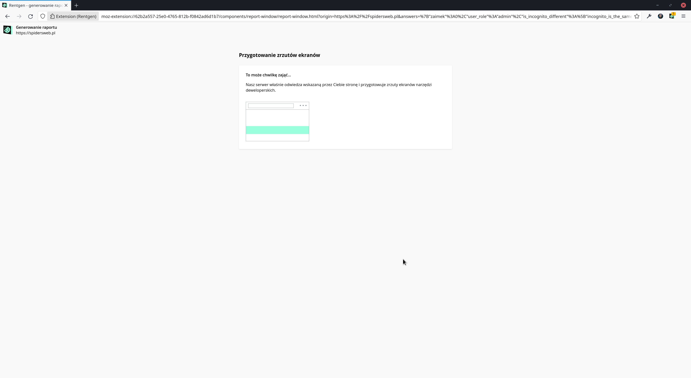
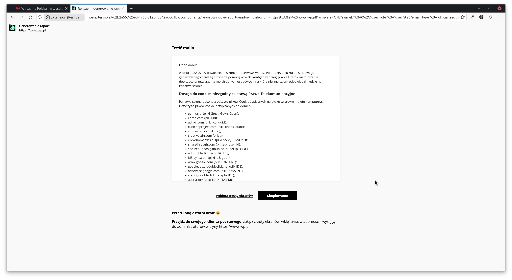
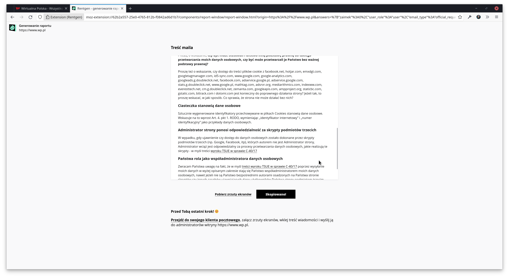

<h1 style="display: flex; align-items: center;"> Rentgen</h1>

<strong>Rentgen</strong> to wtyczka dla przeglądarek opartych o Firefoxa, która automatycznie wizualizuje, jakie dane zostały ~~wykradzione~~ wysłane do podmiotów trzecich przez odwiedzane strony.

**Funkcje Rentgena:**

-   analiza ruchu sieciowego generowanego przez stronę internetową;
-   wizualizacja danych przekazanych do podmiotów trzecich przez odwiedzaną stronę (historia przeglądania użytkownika oraz jego ciasteczka);
-   przygotowywanie zrzutów ekranów narzędzi deweloperskich będących dowodem przekazanych danych do podmiotów trzecich;
-   pomoc w oszacowaniu potencjalnych obszarów roboczych względem zgodności z RODO;
-   generowanie raportu lub treści maila, którą można wysłać do administratora oraz Urzędu Ochrony Danych Osobowych.

## Jak zbudować i uruchomić Rentgena ze źródeł

### Wymagania wstępne

-   System operacyjny: Linux x86_64
-   Node.js: 16.x
-   npm: 7.x lub wyższy

### Proces budowy

1. Pobierz repozytorium przez `git pull https://git.internet-czas-dzialac.pl/icd/rentgen.git` lub pobierz archwium zip
2. Przejdź do głównego katalogu pobranego repozytorium
3. Uruchom komendę: `npm install`
4. Uruchom komendę: `npm run build`
5. Uruchom komendę: `npm run create-package`
6. Przejdź do katalogu `web-ext-artifacts`
7. Znajdziesz tam archiwum zip: `rentgen-x-x-x.zip` (`x-x-x` oznaczają wersję wtyczki)

### Kroki do uruchomienia

1. Uruchom Firefoxa i przejdź do strony `about:debugging`
2. Kliknij zakładkę _This Firefox_
3. Kliknij przycisk _Load Temporary Add-on..._
4. Wybierz archiwum, które zbudowałeś w ostatnim kroku procesu budowy

## Zgłaszanie błędów

Link do issue trackera na naszej instancji Discourse: https://forum.internet-czas-dzialac.pl/c/rentgen-issue-tracker

Każdy problem zostanie sprawdzony i przeniesiony na wewnętrzną listę problemów na naszej instancji Gitea: https://git.internet-czas-dzialac.pl/icd/rentgen/issues. Korzystamy z Gitea i najprawdopodobniej w przyszłości dzięki federalizacji Gitea będziemy w stanie wpuścić użytkowników do zgłaszania błędów bezpośrednio ze strony Gitea.

---

## English description 🇬🇧

<strong>Rentgen</strong> is an add-on prepared for Firefox-based browsers. This extension will automatically visualize all the data that a given website ~~steals~~ sends to third parties.

Note: At the moment, we support Polish language because this extension generates mail content that is dedicated to Polish website owners. In further versions of this add-on, we will add other languages as well.

**Features:**

-   analysis of web traffic generated by the visited website;
-   visualization of data transmitted to third parties by the visited site (user's browsing history and cookies);
-   preparation of screenshots of development tools as evidence of data transmitted to third parties;
-   assisting in the evaluation of potential work areas for compliance with GDPR;
-   generating a report or email content that can be sent to an administrator and Personal Data Protection Office in Poland.

## How to build and run Rentgen on your own

### Pre-requirements

-   OS: Linux x86_64
-   Node.js: 16.x version
-   npm: 7.x version or higher

### Build steps

1. Pull repository or download a zip package
2. Go to the root directory of the pulled repository
3. Run command: `npm install`
4. Run command: `npm run build`
5. Run command: `npm run create-package`
6. Go to the `web-ext-artifacts` directory
7. You will find a zip archive: `rentgen-x-x-x.zip` (`x-x-x` means add-on version)

### Run steps

1. Run Firefox and go to `about:debugging`
2. Click _This Firefox_ tab
3. Click _Load Temporary Add-on..._ button
4. Pick the zip archive from last step of build process.

## Issue tracker

Link to issue tracker on our Discourse instance: https://forum.internet-czas-dzialac.pl/c/rentgen-issue-tracker

Each issue will be reviewed and moved to an internal issues list of our Gitea instance: https://git.internet-czas-dzialac.pl/icd/rentgen/issues. We use Gitea and most likely in the future with the federalization of Gitea, we will be able to let users in to report issues directly from the Gitea site.

## Screenshots

