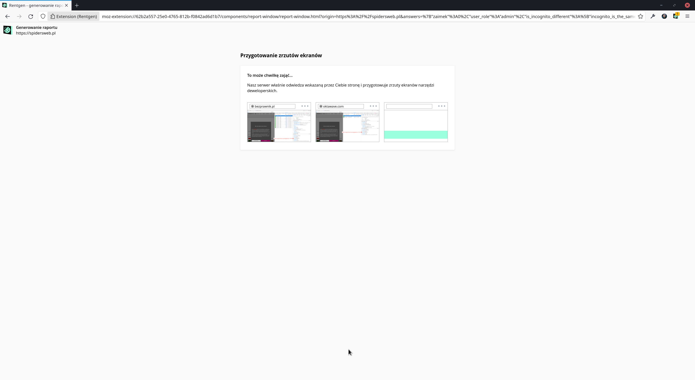

<h1 style="display: flex; align-items: center;"> Rentgen</h1>

<strong>Rentgen</strong> to wtyczka dla przeglądarek opartych o Firefoxa, która automatycznie wizualizuje, jakie dane zostały ~~wykradzione~~ wysłane do podmiotów trzecich przez odwiedzane strony.

## Funkcje Rentgena:

<ul>
    <li>
        analiza ruchu sieciowego generowanego przez stronę internetową;
    </li>
    <li>
        wizualizacja danych przekazanych do podmiotów trzecich przez odwiedzaną stronę (historia przeglądania użytkownika oraz jego ciasteczka);
    </li>
    <li>
        przygotowywanie zrzutów ekranów narzędzi deweloperskich będących dowodem przekazanych danych podmiotom trzecim;
    </li>
    <li>
        pomoc w oszacowaniu potencjalnych obszarów roboczych względem zgodności z RODO;
    </li>
    <li>
        generowanie raportu lub treści maila, którą można wysłać do administratora oraz Urzędu Ochrony Danych Osobowych.
    </li>
</ul>

## English description

English: <strong>Rentgen</strong> is an add-on prepared for Firefox based browsers. This extension will automatically visualize all the data that a given website ~~steals~~ sends to third parties.

Note: At the moment, we support Polish language because this extension generates mail content that is dedicated to Polish website owners. In further versions of this add-on, we will add other languages as well.

## How to build and run add-on

1. Prepare node 16.x+ and npm 7.x+
2. `npm install`
3. `npm run build`
4. The build code is located in the `lib/` directory

## Screenshots

